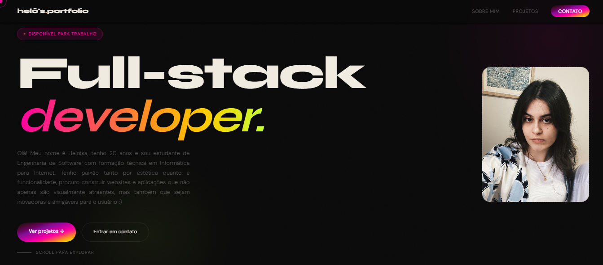
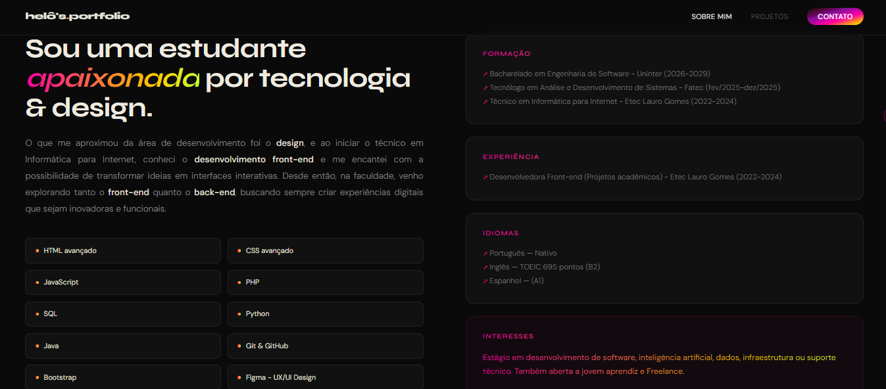
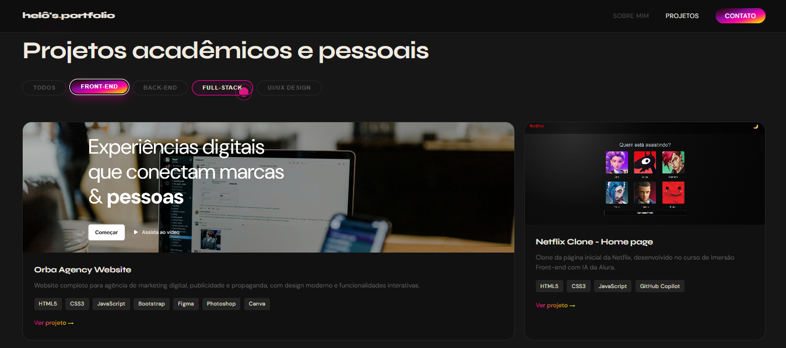
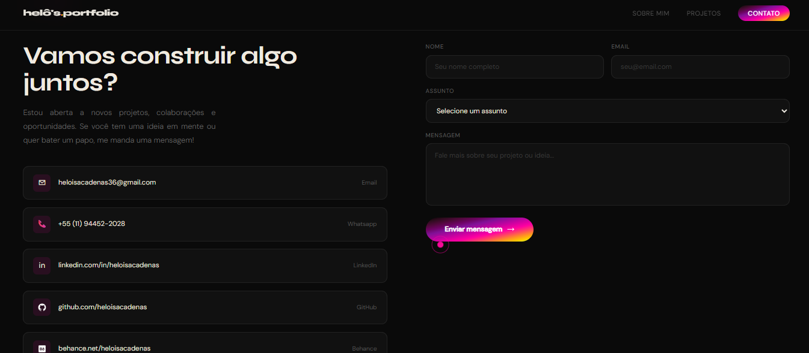
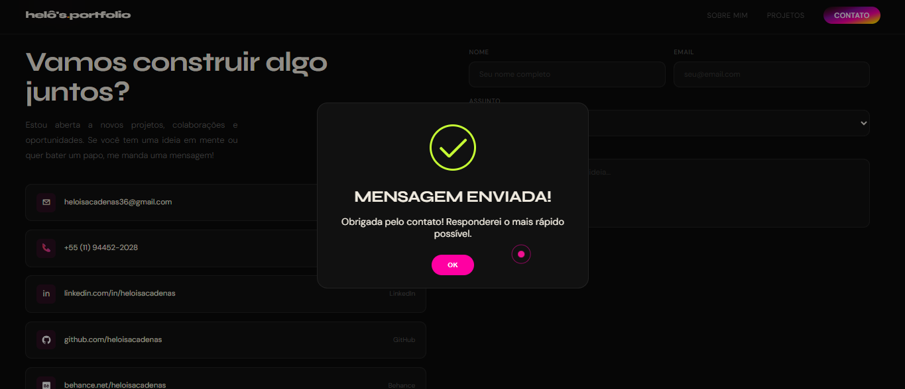

## 🌸 Meu portfólio
#### Portfólio desenvolvido para apresentar minha trajetrória acadêmica e profissional, juntamente aos meus projetos desenvolvidos, divididos em Front-end, Back-end, Full-stack e UI/UX Design.
## Preview

## Tecnologias utilizadas:
- HTML5
- CSS3
- JavaScript
- EmailJS
- Sweet Alert
- Git
- Claude AI

## Funcionalidades:
- Visualização de projetos por categoria
- Envio e recebimento de emails
- Acesso a links externos com facilidade
- Alert customizado
- Design estruturado e moderno

## 💗 Desenvolvido por
### Heloisa Cadenas Maciel

